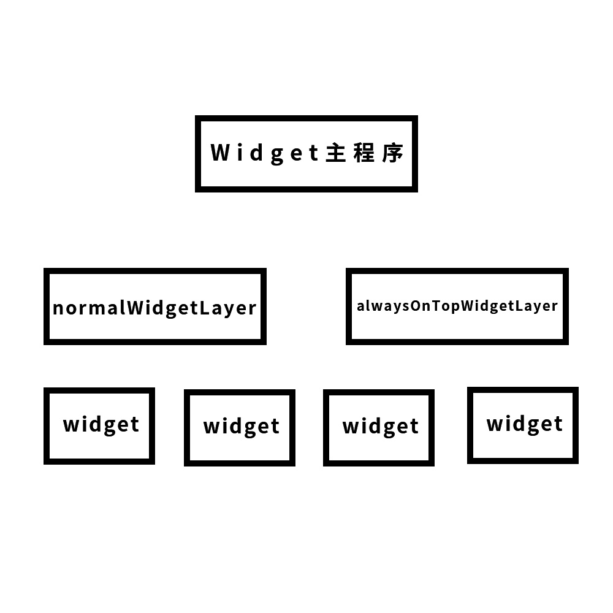

# Widget

一个基于Electron的桌面控件应用

## 为什么开发Widget？

很简单，因为我只想使用WallPaperEngine中的HTML动态桌面功能，但WallPaperEngine要19块。。

## 开发到什么程度了？
定义了一套插件标准，部分功能还未实现，已经可以向桌面中添加小控件了，并实现了内建控件桌面时钟。

## Widget架构
Widget中的基本单位是Widget。

这句话是递归吗？不是！

前面的Widget是项目的名字，后面的Widget是桌面小控件。

对，Widget提供一个桌面小控件开发规范，并提供一个加载器，将按这套规范开发的桌面小控件加载到桌面中。

所以，Widget的用户除了可以使用桌面控件，还可以手动开发自己的桌面小控件。

Widget的大体框架如下：



如你所见，Widget中分了两个控件层，第一个是普通的控件层，这个控件会被其他窗口遮挡，它类似于背景图层，你可以把它认为是依附在桌面上，但其实他只是一个普通窗口。

而alwaysOnTopWidgetLayer考虑到了一些控件需要始终在最顶层，比如内建控件中有一款键盘按键回显器，它始终要在最顶层。

对于用户和开发者，这一切并不可见。开发者只需设置控件的`alwaysOnTop`属性，Widget就会自动分配它们到适当的层上。

桌面控件还有很多属性，通过设置它们，可以让桌面控件更加强大。


### 控件规范
一个基本控件的目录结构如下：
```
avater.jpg     //控件的封面
config.json    //控件配置文件
setting.json   //控件的用户设置项
widget.html    //控件入口文件
```

配置文件大概是这样：
```json
{
    "name": "控件名称",
    "description": "控件描述",
    "author": "控件开发者",
    "versionCode": "控件版本标识",
    "position": [-1,-1], // 控件位置，xy，特殊值-1、-2分别代表居中和结束位置
    "focusable": true,// 控件是否可以获取鼠标焦点
    "dragable": true, // 控件是否可以被拖动位置
    "permission": []  // 控件权限列表
}
```

用户设置文件的格式大概是这样：
```json
[
    {
        "id": "设置项的唯一id",
        "label": "设置项显示给用户的名字",
        "description": "设置项功能描述", 
        "type": "设置项类型，可以是text，select，color，boolean等", 
        "items": ["12 hours","24 hours"],
        "value": 1 
    }
    //...
]
```

封面的格式要求：`200*200 JPG`

### 目前进度
* 实现了加载控件到桌面

不太想继续往下搞了，哎哎哎

### 二次开发

```bash
git clone https://github.com/YHaoNan/widget.git
cd widget
npm start
```

项目目录结构
```
assets  --  主程序资源目录（字体、图标、公用js）
builtin_widget  --  内建控件
controller  --  BrowserWindow的js文件
decorater  --  BrowserWindow的css文件
ui  --  BrowserWindow的HTML文件
main.js  --  主进程入口文件
**.js  --  一些辅助文件
```